## 💫 About Me
🤖 Automation addict. Less toil, more signal. 📈  
☁️ Cloud/SRE with Kubernetes + Terraform on Azure/AWS/GCP. 🧩🏗️  
🔒 Current focus: platform hardening, SOC2/ISO-ready pipelines, and Go utilities for ops. 🛡️🔁  
🛋️ Ask me about getting max results with strategic laziness — and cat-assisted debugging. 🐈‍⬛

## 💻 Tech Stack:
##### Cloud
   
##### Languages
    
##### OS
      
##### Containers
    
##### Databases
  
##### CI/CD
  
##### Monitoring
    
##### Virtualization
  
##### Documentation & Project Management
  
##### Infrastructure as Code
  

## 📊 GitHub Stats:

## 🏆 GitHub Trophies

---

### ✍️ Random Dev Quote

### 🔝 Top Contributed Repo

---

